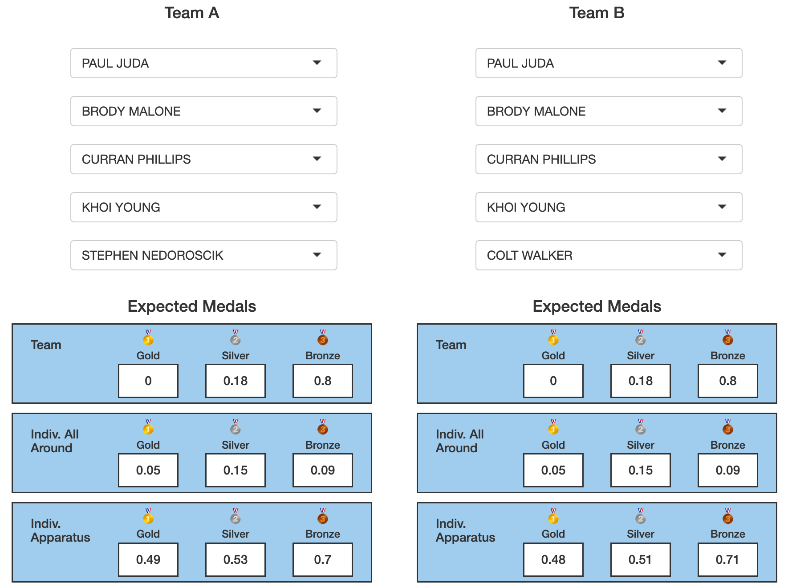

```{r setup, include=FALSE}
knitr::opts_chunk$set(echo = FALSE)
```


# Objective

This project aims to answer the question of team selection for USA Gymnastics for the Summer Olympic Games. By simulating athletes' scores based on their historic performance and incorporating a system of weights to allow for prioritization of different medals and events, we introduce an interactive tool to generate optimized teams and compare team performance to make data-driven decisions in selecting Team USA.

# Introduction

In this project, we attempt to improve USA Gymnastics' team selection criteria for the Summer Olympic Games. For the 2020 Tokyo Olympics (held in 2021), the US Olympic and Paralympic Committee (USOPC) selected the men's team solely to maximize the chance of winning the team gold medal. Given the quality of opposing men's gymnastics teams, such a goal wasn't entirely feasible, and optimizing for the team event came at the expense of single-event specialists who could've won medals in the individual events. We improve this methodology by creating an interactive tool that allows the USOPC to make data-based selection decisions while prioritizing certain events or medal types. It also provides a breakdown of expected medal count in each event for each combination of gymnasts, allowing the user to compare five-person teams and their expected scores side by side.

We used a dataset that contains the full results of top gymnastics competitions in the 2022-23 season. Each athlete is listed with their name, country, competition name, competition date, apparatus, and score. Since the dataset includes the most prestigious events, such as the World Championships, U.S. National Championships, European Championships, and Commonwealth Games, we had with sufficient data for all of the world's top gymnasts in the season.

# Modeling and Analysis

Our team selection model consisted of running a series of simulations for each athlete in order to predict their medal outcome. In order to ensure the medal predictions for Team USA were reliable, we followed the same team selection and simulation procedures for all countries' competitors.

The flowchart below overviews the steps taken for our simulation.

```{r, fig.align='center', fig.height=10, fig.cap='Steps taken in team selection process.'}
DiagrammeR::grViz("digraph {
  graph [layout = dot, rankdir = TB]
  
  node [shape = rectangle]        
  rec1 [label = 'Group together scores from each athlete and obtain their personal mean and standard deviation']
  rec2 [label = 'Identify top-performing athletes from each country.']
  rec3 [label =  'Simulate each possible combination of 5 athletes from all 12 countries and calculate expected medals.']
  rec4 [label = 'Weight expected medals according to desired criteria.']
  rec5 [label = 'Pick best team based on weighted expected medals.' ]
  
  # edge definitions with the node IDs
  rec1 -> rec2 -> rec3 -> rec4 -> rec5
  }",
                  height = 500)
```


The tables below show the number of athletes considered in the pool for each of the twelve countries, for both men and women.

```{r}
country_m <- c("CAN", "CHN", "ESP", "GBR", "GER", "ITA", "JPN", "NED", "SUI", "TUR", "UKR", "USA")
athletes_m <- c(10, 11, 8, 11, 10, 13, 15, 6, 11, 8, 8, 14)

# Create data frame
df_m <- data.frame(athletes_m, row.names = country_m) |> t() 
row.names(df_m) <- NULL
# Print table
knitr::kable(df_m, caption = "Number of athletes per country (men)", format = "markdown", col.names = country_m)

```

```{r}
country_w <- c("AUS", "BRA", "CAN", "CHN", "FRA", "GBR", "ITA", "JPN", "KOR", "NED", "ROU", "USA")
athletes_w <- c(9, 7, 9, 14, 11, 7, 8, 12, 7, 9, 7, 10)

df_w <- data.frame(athletes_w, row.names = country_w) |> t() 
row.names(df_w) <- NULL
# Print table
knitr::kable(df_w, caption = "Number of athletes per country (women)", format = "markdown", col.names = country_w)
```

```{=tex}
\begin{table}[h]
    \centering
    \caption{Number of athletes per country (women)}
    \begin{tabular}{|c|c|c|c|c|c|c|c|c|c|c|c|}
        \hline
        AUS & BRA & CAN & CHN & FRA & GBR & ITA & JPN & KOR & NED & ROU & USA \\
        \hline
        9   & 7   & 9   & 14  & 11  & 7   & 8   & 12  & 7   & 9   & 7   & 10  \\
        \hline
    \end{tabular}
\end{table}
```


# Visualization and Interpretation

Once the simulations were run, one of the key features of this analysis was putting together our findings into an interactive shiny app. The outcome allows users to choose their own custom preferences for weights and explore how different teams might perform differently in competition. This allows for a very thorough exploration of how different groups of athletes will perform.

The shiny app has two main tabs. For each tab, the user is able to pick whether they want to consider men or women, and which country they would like to look at. These preferences carry over when the tab is changed.

Below, we show an example of the shiny app in action for the USA men's team. We hope to highlight a few of the primary capabilities and the conclusions one can draw from them.
```{r,fig.align='center', out.width='50%', fig.cap='Results of the simulation for all medals and events weighted equally as displayed in the shiny app. The optimal team and their expected medals are displayed below.'}
knitr::include_graphics('report_images/shiny_ex.png')
```


If we choose to weight all of the medals and events the same for the USA mens' team, our model chooses Paul Juda, Brody Malone, Curran Phillips, Stephen Nedoroscik, and Khoi Young as the best team. This is an interesting outcome - in particular, the selection of Stephen Nedoroscik stands out as an event specialist - while the other 4 selected athletes compete in multiple or all events, Nedoroscik competes only in the pommel horse. 

If we go to the "Compare Teams" tab, we can see the consequences of this.
Let's compare our optimal team above with one where we switch our event specialist with a more well-rounded athlete, say, Colt Walker, who competes in five different events.

```{r,fig.align='center', out.width='50%', fig.cap='The Compare Teams slide of the shiny app shows the expected medals for two teams side by side. Under Team A on the left, we have our "optimal team" chosen for us by the model under equal weights. Under Team B, we keep all of the athletes the same, but sub Stephen Nedoroscik for Colt Walker.'}

```

As we can see event specialist like Nedoroscik is useful when individual apparatus medals are considered equally important as the team and individual all-around events. While the expected medals for the team and individual all-around do not change, we see slightly higher expectations for gold and silver on the individual apparatus events.

Of course, one may decide that for instance they may value the team event more than the individual events. The model allows for the user to experiment with their own preferences. However, in the context of the problem, it is interesting that the model places focus on event specialists when the the team medal is unlikely, like it is for the US men.


```{r, fig.align='center', fig.cap='Scan the QR code to access the interactive shiny app, or visit aespears.shinyapp.io/team_selection_shiny . '}

knitr::include_graphics('report_images/QR_code.png')
```

# Conclusions and Recommendations
As our tool demonstrates, there is not necessarily "one" correct team to recommend. We hope to offer a bit of flexibility to users based on what medals and events they choose to prioritize, as well as allow for flexible substitutions. In the example discussed above, we can see how 
the data recommends event specialists when all medals are weighted equally. In sum, by simulating the competition for a series of athletes, we are able to gain insight on what makes a team successful as well as how small changes to the members of a team can influence the team's outcome in large or small ways.


