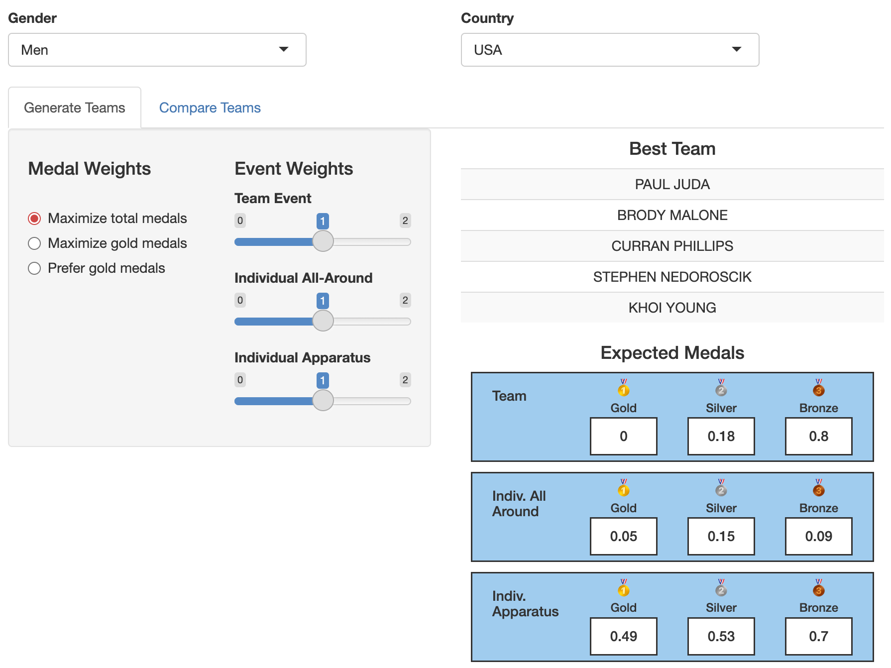
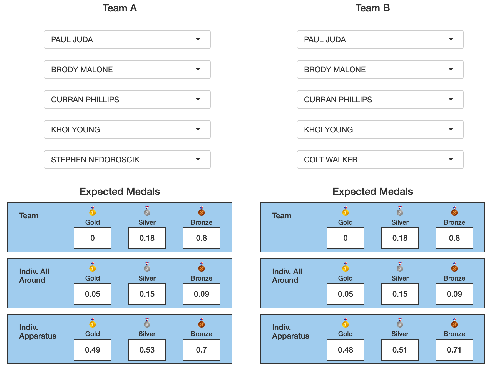

```{r setup, include=FALSE}
knitr::opts_chunk$set(echo   =FALSE,      ## show or suppress the code
                      include=TRUE ,      ## show or suppress the output
                      message=FALSE,      ## omit messages generated by code
                      warning=FALSE,      ## omit warnings generated by code
                      comment=NA,         ## removes the ## from in front of outputs
                      fig.align="center", ## centers all figures
                      fig.height = 5,     ## set the default height
                      fig.weight = 5      ## set the default width
                      )
```

## Abstract

This project aims to answer the question of team selection for USA Gymnastics for the Summer Olympic Games. By simulating athletes' scores based on their historic performance and incorporating a system of weights to allow for prioritization of different medals and events, we introduce an interactive tool to generate optimized teams and compare team performance to make data-driven decisions in selecting Team USA.

## Introduction

In this project, we attempt to improve USA Gymnastics' team selection criteria for the Summer Olympic Games. For the 2020 Tokyo Olympics (held in 2021), the US Olympic and Paralympic Committee (USOPC) selected the men's team solely to maximize the chance of winning the team gold medal. Given the quality of opposing men's gymnastics teams, such a goal wasn't entirely feasible, and optimizing for the team event came at the expense of single-event specialists who could've won medals in the individual events. We improve this methodology by creating an interactive tool that allows the USOPC to make data-based selection decisions while prioritizing certain events or medal types. It also provides a breakdown of expected medal count in each event for each combination of gymnasts, allowing the user to compare five-person teams and their expected scores side by side.

We used a dataset that contains the full results of top gymnastics competitions in the 2022-23 season. Each athlete is listed with their name, country, competition name, competition date, apparatus, and score. Since the dataset includes the most prestigious events, such as the World Championships, U.S. National Championships, European Championships, and Commonwealth Games, we had with sufficient data for all of the world's top gymnasts in the season.

Section 2 contains data exploration, which reveals that many gymnasts were present in the data under multiple names, requiring consolidation before further analysis. In Section 3, we build several different predictive models and find that each country in the Olympic team event has between 6 and 15 athletes to choose from who could reasonably contribute to an "optimal" group under our criteria. We discuss the results of the model, including the presence of single-apparatus specialists on the USA men's team, in Section 4. Finally, we discuss conclusions, recommendations and ideas for future work in Section 5.

## Data exploration

Many steps had to take place before we were able to create our model. In particular, our data set was sourced from a series of gymnastics competitions throughout the 2022-2023 competitive season. Discrepancy between events meant that many athletes were listed under a few different names, sometimes with different spellings, middle names listed, or differences in spacing or capitalization. Careful consideration was taken to ensure that athletes were credited for all of their appearances, and this meant we had to incorporate extensive data cleaning.

Our raw data listed each athlete's score for each apparatus at all of the competitions. The nature of this meant that some athletes had more appearances than others, which allows us to have greater insight on their long-term performance than athletes who only competed a small number of times.

From there, we made sure to group up athletes by country and apparatus in order to continue with our analysis. For the sake of our simulations, we made sure to focus on the twelve countries each for men and women that have qualified for the 2024 Paris Olympic Games in order to inform our predictions. We also incorporated the other qualifying athletes from the countries who did not qualify for the team competition.


## Modeling/Analysis

Our team selection model consisted of running a series of simulations for each athlete in order to predict their medal outcome. In order to ensure the medal predictions for Team USA were reliable, we followed the same team selection and simulation procedures for all countries' competitors.

This procedure began with grouping together each athlete's scores and obtaining their personal mean and standard deviation from each apparatus. We chose to exclude the athletes within the top 15% highest variance for some apparatus to account for those who might be prone to falling or other risks.

We also approximated each athlete's individual all-around score by totaling up their averages for each of the 4 apparatuses for women and each of the 6 apparatuses for men.

In order to speed up simulations, we chose to limit our athlete pool to only athletes who were either in the top 3 all-around for their country or within the top 3 for at least one apparatus for their country, based on their averaged scores. Due to the large amount of simulations necessary for our team selection, it was important to us to limit our pool of athletes as best we could in the interest of time. Our reasoning was if an athlete was not in the top 3 for any event within their own country, it would be unlikely for them to get a medal in an international competition. This resulted in somewhere between 6 and 15 potential athletes to consider for each of the competing countries.

```{=tex}
\begin{table}[h]
    \centering
    \caption{Number of athletes per country (men)}
    \begin{tabular}{|c|c|c|c|c|c|c|c|c|c|c|c|}
        \hline
        CAN & CHN & ESP & GBR & GER & ITA & JPN & NED & SUI & TUR & UKR & USA \\
        \hline
        10  & 11  & 8   & 11  & 10  & 13  & 15  & 6   & 11  & 8   & 8   & 14  \\
        \hline
    \end{tabular}
\end{table}
```
```{=tex}
\begin{table}[h]
    \centering
    \caption{Number of athletes per country (women)}
    \begin{tabular}{|c|c|c|c|c|c|c|c|c|c|c|c|}
        \hline
        AUS & BRA & CAN & CHN & FRA & GBR & ITA & JPN & KOR & NED & ROU & USA \\
        \hline
        9   & 7   & 9   & 14  & 11  & 7   & 8   & 12  & 7   & 9   & 7   & 10  \\
        \hline
    \end{tabular}
\end{table}
```
In each round of simulations, we began by initializing the teams randomly by selecting five athletes from each country.

Then, one at a time, we chose one of the 12 countries with a team and went through every possible combination of 5 athletes, keeping the other 11 countries' teams fixed. In each round of the simulation, we used a normal approximation using their personal mean and standard deviation for each event for all of the athletes to approximate a potential score in competition. The team round was simulated by choosing the best 3 athletes per apparatus per country and summing up their scores. We were able to thus approximate medal placements by ranking the simulated scores for each event. Random samples were drawn 99 times for each group of athletes in order to account for variability in our random samples. By taking the average, we calculated the expected number of gold, silver, and bronze medals for the team, breaking it into categories of "team round", "individual all around," and "individual apparatus."

Finally, the expected medals were multiplied by the provided weights and the "optimal team" was chosen for the selected country based on which combination of five athletes provided the highest weighted total. This optimal team was passed back into the roster of teams so when the next country was passed through we would make sure they were competing against the best possible athletes. For this, we made sure to pass through each country twice in order to get as close as possible to simulating a real competition between the top athletes. This same procedure was repeated for both men and women.

A key part of our analysis was to weight events and medals based on various criteria. In the interactive Shiny app, the user is given the opportunity to show the best team based on what they value the most.

Sliders are provided to weight each type of event ("team round", "individual all around," and "individual apparatus") between 0, 1, and 2, and clickable buttons let the user choose between "maximize total medals," where gold, silver, and bronze are weighted equally, "maximize gold medals", where silver and bronze medals are not considered, and "prefer gold medals," where gold medals are weighted higher than silver or bronze. This allows for an added degree of interactivity when choosing which team is preferred.

This means that all of the simulations had to be run multiple times to account for each possible weightings.

## Visualization and interpretation

Once the simulations were run, one of the key features of this analysis was putting together our findings into an interactive shiny app. The outcome allows users to choose their own custom preferences for weights and explore how different teams might perform differently in competition. This allows for a very thorough exploration of how different groups of athletes will perform.

The shiny app has two main tabs. For each tab, the user is able to pick whether they want to consider men or women, and which country they would like to look at. These preferences carry over when the tab is changed.

The first tab is called "Generate Teams," which gives the user a clickable panel to choose their preferences for medals and which events they would like to prioritize. Once the weight options are chosen, the right panel auto-populates with a list of the five athletes that will give the best performance under those criteria and the number of gold, silver, and bronze medals this particular team would be expected to win.

The second tab, entitled "Compare Teams" gives the user a bit more flexibility in team selection. Here, we can compare side-by-side how two different groups of five athletes would be expected to perform. This has huge potential - we can see clearly how important particular athletes are to their teams, and can consider alternative options in case an athlete gets injured or decides not to compete.

Below, we show an example of the shiny app in action for the USA men's team. We hope to highlight a few of the primary capabilities and the conclusions one can draw from them.
```{r,fig.align='center', out.width='50%', fig.cap='Results of the simulation for all medals and events weighted equally as displayed in the shiny app. The optimal team and their expected medals are displayed below.'}

```


If we choose to weight all of the medals and events the same for the USA mens' team, our model chooses Paul Juda, Brody Malone, Curran Phillips, Stephen Nedoroscik, and Khoi Young as the best team. This is an interesting outcome - in particular, the selection of Stephen Nedoroscik stands out as an event specialist - while the other 4 selected athletes compete in multiple or all events, Nedoroscik competes only in the pommel horse. 

If we go to the "Compare Teams" tab, we can see the consequences of this.
Let's compare our optimal team above with one where we switch our event specialist with a more well-rounded athlete, say, Colt Walker, who competes in five different events.

```{r,fig.align='center', out.width='50%', fig.cap='The Compare Teams slide of the shiny app shows the expected medals for two teams side by side. Under Team A on the left, we have our "optimal team" chosen for us by the model under equal weights. Under Team B, we keep all of the athletes the same, but sub Stephen Nedoroscik for Colt Walker.'}

```

As we can see event specialist like Nedoroscik is useful when individual apparatus medals are considered equally important as the team and individual all-around events. While the expected medals for the team and individual all-around do not change, we see slightly higher expectations for gold and silver on the individual apparatus events.

Of course, one may decide that for instance they may value the team event more than the individual events. The model allows for the user to experiment with their own preferences. However, in the context of the problem, it is interesting that the model places focus on event specialists when the the team medal is unlikely, like it is for the US men.


## Conclusions and recommendations

As our tool demonstrates, there is not necessarily "one" correct team to recommend. We hope to offer a bit of flexibility to users based on what medals and events they choose to prioritize, as well as allow for flexible substitutions. In the example discussed above, we can see how 
the data recommends event specialists when all medals are weighted equally. In sum, by simulating the competition for a series of athletes, we are able to gain insight on what makes a team successful as well as how small changes to the members of a team can influence the team's outcome in large or small ways.